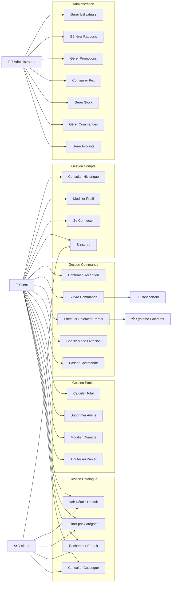
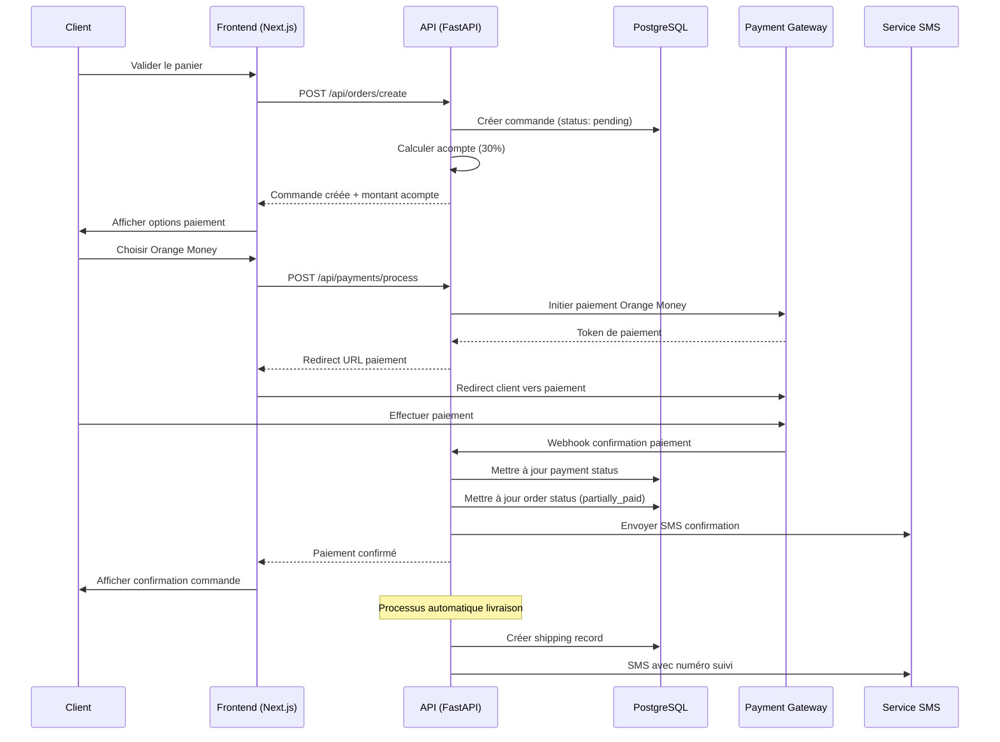
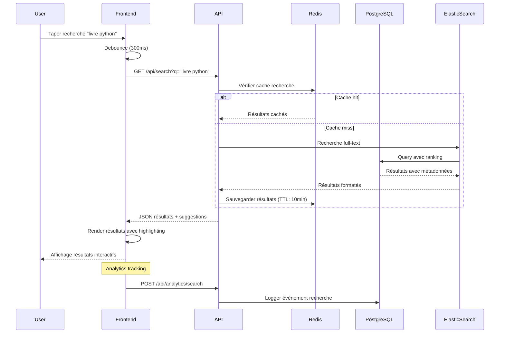
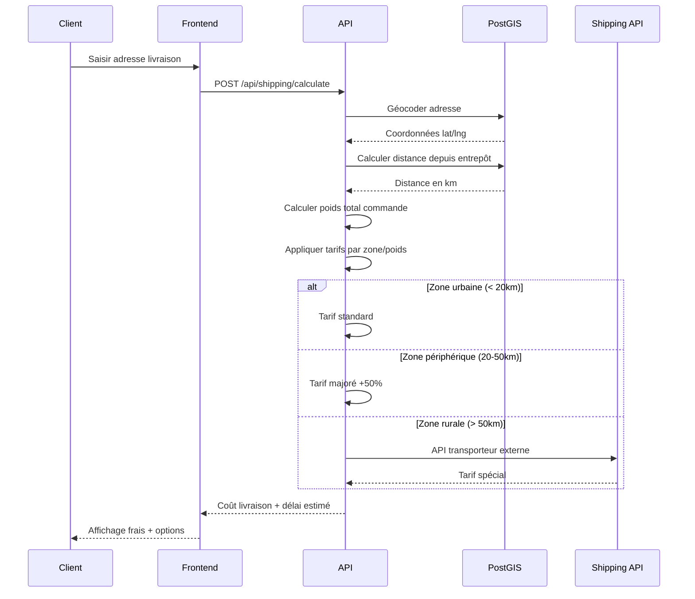
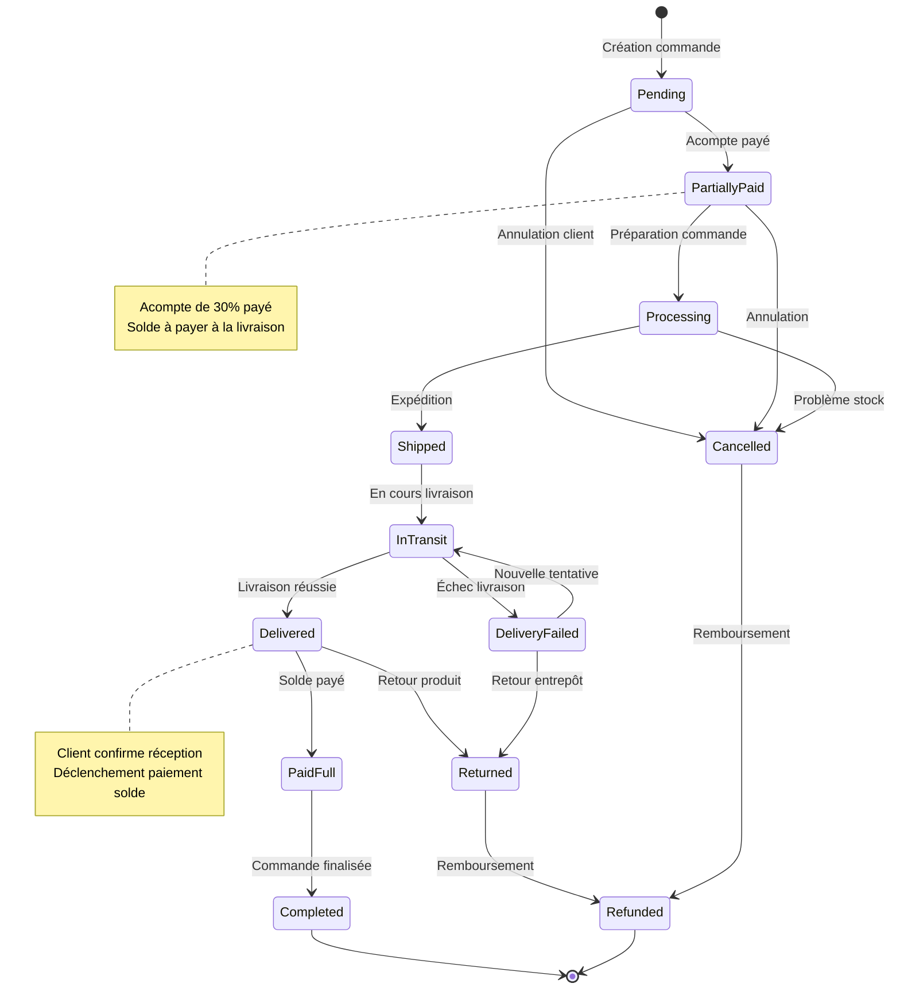
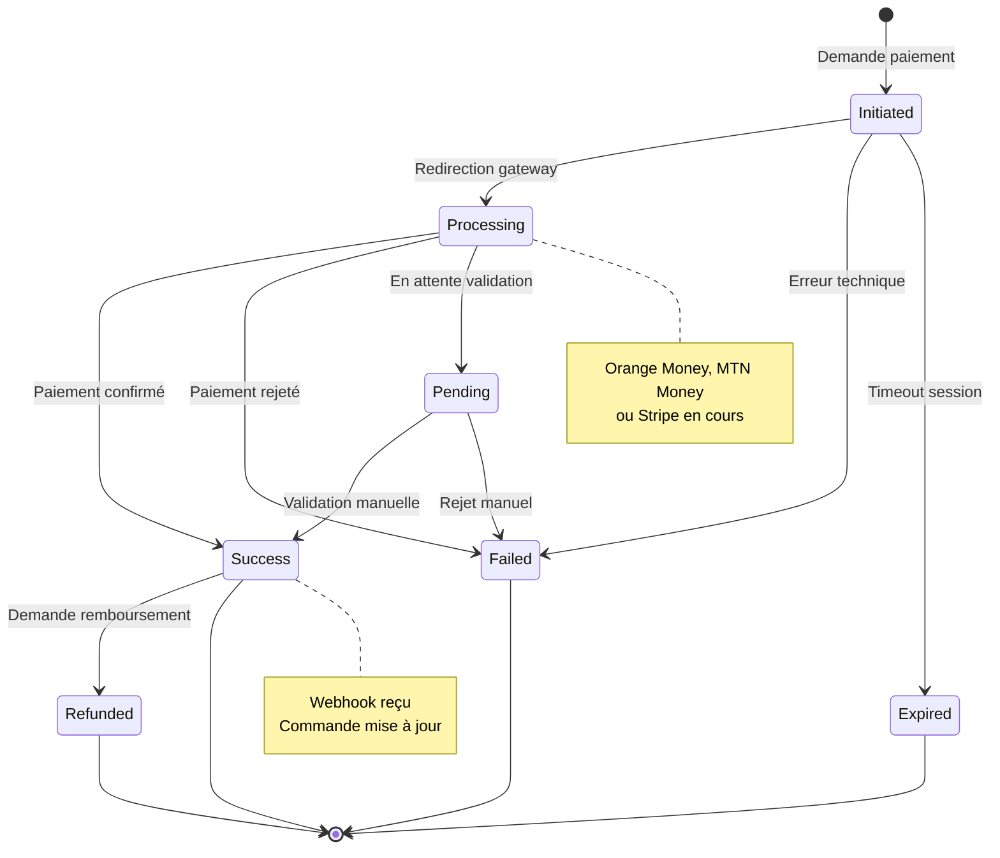
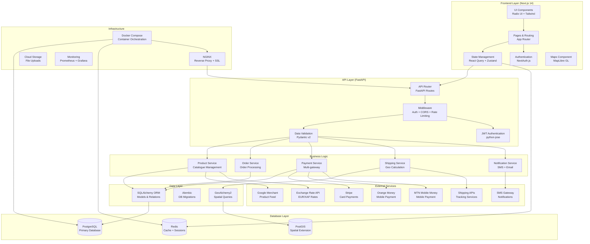
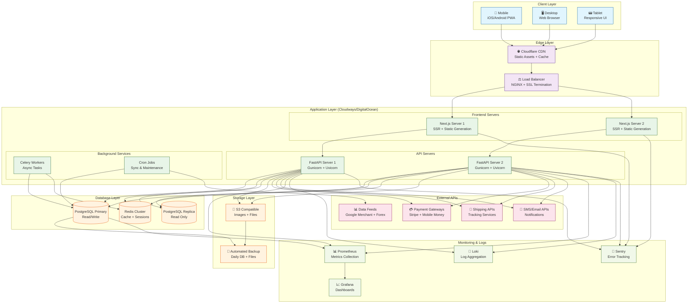
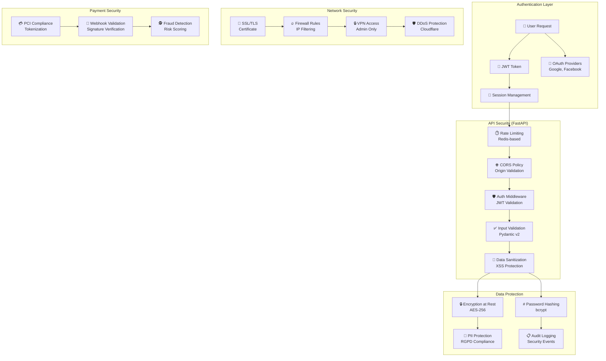

# Diagrammes UML - PromoWeb Africa

Documentation complète des diagrammes UML pour la plateforme e-commerce PromoWeb utilisant Next.js 14, FastAPI, PostgreSQL+PostGIS.

## 1. 👥 Diagramme de Cas d'Utilisation (Use Cases)



## 2. 🏗️ Diagramme de Classes Principal

```mermaid
classDiagram
    class User {
        +String id
        +String email
        +String firstName
        +String lastName
        +String phone
        +String address
        +DateTime createdAt
        +DateTime updatedAt
        +Boolean isActive
        +register()
        +login()
        +updateProfile()
        +getOrders()
    }
    
    class Admin {
        +String role
        +Array permissions
        +manageProducts()
        +manageOrders()
        +generateReports()
    }
    
    class Product {
        +String id
        +String title
        +String description
        +String isbn
        +String ean
        +String brand
        +String category
        +Float priceEur
        +Float priceXaf
        +Integer stock
        +Array images
        +Boolean isActive
        +DateTime createdAt
        +calculateFinalPrice()
        +updateStock()
        +applyPromotion()
    }
    
    class Category {
        +String id
        +String name
        +String description
        +String slug
        +Integer sortOrder
        +Boolean isActive
    }
    
    class Cart {
        +String id
        +String userId
        +Array items
        +Float totalAmount
        +DateTime createdAt
        +addItem()
        +removeItem()
        +updateQuantity()
        +calculateTotal()
        +clear()
    }
    
    class CartItem {
        +String productId
        +Integer quantity
        +Float unitPrice
        +Float totalPrice
    }
    
    class Order {
        +String id
        +String userId
        +String status
        +Float totalAmount
        +Float depositAmount
        +Float remainingAmount
        +String shippingAddress
        +String paymentMethod
        +DateTime createdAt
        +DateTime deliveredAt
        +calculateShipping()
        +updateStatus()
        +processPayment()
    }
    
    class OrderItem {
        +String orderId
        +String productId
        +Integer quantity
        +Float unitPrice
        +Float totalPrice
    }
    
    class Payment {
        +String id
        +String orderId
        +String type
        +Float amount
        +String status
        +String gateway
        +String transactionId
        +DateTime createdAt
        +processPayment()
        +refund()
    }
    
    class Shipping {
        +String id
        +String orderId
        +String carrier
        +String trackingNumber
        +String status
        +Float weight
        +Float cost
        +Address deliveryAddress
        +DateTime shippedAt
        +DateTime deliveredAt
        +calculateCost()
        +updateTracking()
    }
    
    class Promotion {
        +String id
        +String name
        +String type
        +Float discount
        +DateTime startDate
        +DateTime endDate
        +Boolean isActive
        +apply()
        +isValid()
    }
    
    class Inventory {
        +String productId
        +Integer quantity
        +Integer reservedQuantity
        +Integer minThreshold
        +DateTime lastUpdated
        +updateStock()
        +reserveStock()
        +releaseStock()
    }
    
    %% Relations
    User ||--o{ Order : places
    User ||--|| Cart : has
    Admin --|> User : extends
    
    Product ||--o{ CartItem : contains
    Product ||--o{ OrderItem : contains
    Product }o--|| Category : belongs_to
    Product ||--o{ Inventory : has
    
    Cart ||--o{ CartItem : contains
    Order ||--o{ OrderItem : contains
    Order ||--o{ Payment : has
    Order ||--|| Shipping : has
    
    Promotion }o--o{ Product : applies_to
```

## 3. 📋 Diagrammes de Séquences

### 3.1. Processus de Commande avec Paiement Partiel



### 3.2. Synchronisation Automatique des Produits

```mermaid
sequenceDiagram
    participant Cron as Cron Job
    participant A as API (FastAPI)
    participant GM as Google Merchant
    parameter FX as Forex API
    participant DB as PostgreSQL
    participant Cache as Redis
    
    Cron->>A: Déclenchement tâche quotidienne
    A->>GM: GET XML feed produits
    GM-->>A: XML data (prix EUR)
    
    A->>FX: GET taux EUR/XAF
    FX-->>A: Taux de change actuel
    
    loop Pour chaque produit
        A->>A: Calculer prix XAF final
        A->>A: Arrondir à 100 XAF près
        A->>DB: Upsert produit
        A->>Cache: Invalider cache produit
    end
    
    A->>A: Générer rapport sync
    A->>DB: Logger résultat sync
    
    Note over A: Notifications admin si erreurs
    alt Si erreurs critiques
        A->>SMS: Alerter admin
    end
```

### 3.3. Recherche Intelligente avec Cache



### 3.4. Calcul Frais de Livraison Géospatial



## 4. 🔄 Diagramme de Transitions d'États

### 4.1. États d'une Commande



### 4.2. États d'un Paiement



## 5. 🎯 Diagramme d'Activités - Processus Complet de Commande

```mermaid
flowchart TD
    Start([Client visite catalogue]) --> Browse[Parcourir produits]
    Browse --> Search{Recherche spécifique?}
    Search -->|Oui| SearchBox[Utiliser barre recherche]
    Search -->|Non| Filter[Appliquer filtres]
    
    SearchBox --> ViewProduct[Voir détails produit]
    Filter --> ViewProduct
    
    ViewProduct --> AddCart{Ajouter au panier?}
    AddCart -->|Oui| CartAdd[Produit ajouté]
    AddCart -->|Non| Browse
    
    CartAdd --> ContinueShopping{Continuer achats?}
    ContinueShopping -->|Oui| Browse
    ContinueShopping -->|Non| ViewCart[Voir panier]
    
    ViewCart --> Login{Client connecté?}
    Login -->|Non| Register[Inscription/Connexion]
    Login -->|Oui| Checkout[Processus commande]
    
    Register --> Checkout
    
    Checkout --> Address[Saisir adresse livraison]
    Address --> CalcShipping[Calculer frais livraison]
    CalcShipping --> PaymentMethod[Choisir mode paiement]
    
    PaymentMethod --> PartialPay[Paiement acompte 30%]
    PartialPay --> PaymentGateway[Redirection gateway]
    PaymentGateway --> PaymentResult{Paiement réussi?}
    
    PaymentResult -->|Non| PaymentFailed[Échec paiement]
    PaymentResult -->|Oui| OrderConfirm[Confirmation commande]
    
    PaymentFailed --> PaymentMethod
    
    OrderConfirm --> SMS1[SMS confirmation]
    SMS1 --> Prepare[Préparation commande]
    Prepare --> Ship[Expédition]
    Ship --> SMS2[SMS numéro suivi]
    SMS2 --> Track[Suivi livraison]
    Track --> Delivery[Livraison]
    Delivery --> PayRemain[Paiement solde]
    PayRemain --> Complete[Commande terminée]
    
    Complete --> End([Fin])
    
    style Start fill:#e1f5fe
    style End fill:#e8f5e8
    style PaymentGateway fill:#fff3e0
    style OrderConfirm fill:#e8f5e8
```



## 6. 🏛️ Diagramme de Composants Architecture



## 7. 📊 Diagramme de Déploiement



## 8. 🔐 Diagramme de Sécurité et Authentification



---

## 📚 Guide d'Utilisation des Diagrammes

### 🎯 Objectifs de la Documentation UML

1. **Vision d'ensemble** : Comprendre l'architecture complète
2. **Communication** : Faciliter les échanges entre équipes
3. **Planification** : Guider le développement étape par étape
4. **Maintenance** : Documenter les processus métier
5. **Formation** : Onboarding des nouveaux développeurs

### 🛠️ Outils Recommandés

- **Mermaid Live Editor** : https://mermaid.live
- **VS Code Extension** : Mermaid Markdown Syntax
- **GitHub/GitLab** : Rendu automatique des diagrammes
- **Draw.io** : Alternative pour diagrammes complexes

### 📋 Checklist d'Implémentation

- [ ] **Use Cases** : Valider avec les stakeholders
- [ ] **Classes** : Implémenter les modèles SQLAlchemy
- [ ] **Séquences** : Développer les endpoints FastAPI
- [ ] **États** : Configurer la machine à états
- [ ] **Activités** : Tester les parcours utilisateur
- [ ] **Composants** : Structurer l'architecture
- [ ] **Déploiement** : Configurer l'infrastructure
- [ ] **Sécurité** : Implémenter les contrôles

### 🔄 Mise à Jour

Ces diagrammes doivent évoluer avec le projet :
- **Révision mensuelle** des cas d'utilisation
- **Mise à jour** des diagrammes de classes après modifications
- **Validation** des séquences lors de nouveaux features
- **Documentation** des changements d'architecture

---

*Dernière mise à jour : Septembre 2024*  
*Stack : Next.js 14, FastAPI, PostgreSQL+PostGIS, Docker*
