# Stack Technique - Architecture Complète

```mermaid
graph TB
    %% Utilisateurs et Interfaces
    User[👤 Utilisateur]
    Admin[👨‍💼 Administrateur]
    
    %% Frontend Layer
    subgraph Frontend["🎨 Frontend Layer"]
        NextJS["Next.js 14<br/>React 18<br/>TypeScript"]
        
        subgraph UI["Interface Utilisateur"]
            TailwindCSS["Tailwind CSS<br/>Radix UI<br/>Lucide React"]
            Themes["next-themes<br/>Dark/Light Mode"]
            Motion["framer-motion<br/>Animations"]
        end
        
        subgraph Forms["Gestion Formulaires"]
            RHF["react-hook-form"]
            Zod["zod<br/>Validation"]
        end
        
        subgraph Data["Gestion Données"]
            ReactQuery["@tanstack/react-query<br/>État Global"]
            Axios["axios<br/>HTTP Client"]
        end
        
        subgraph Maps["Cartes & Géolocalisation"]
            MapLibre["maplibre-gl<br/>react-map-gl"]
        end
        
        subgraph Payment["Paiements Frontend"]
            StripeJS["Stripe JS<br/>SDK"]
        end
    end
    
    %% Backend Layer
    subgraph Backend["⚙️ Backend Layer"]
        FastAPI["FastAPI<br/>Framework Python"]
        
        subgraph Servers["Serveurs"]
            Uvicorn["uvicorn<br/>ASGI Server"]
            Gunicorn["gunicorn<br/>Production"]
        end
        
        subgraph Auth["Authentification & Sécurité"]
            JWT["python-jose<br/>JWT Tokens"]
            BCrypt["passlib[bcrypt]<br/>Hash Passwords"]
        end
        
        subgraph Validation["Validation & Config"]
            Pydantic["pydantic v2<br/>Data Validation"]
            Settings["pydantic-settings<br/>Configuration"]
        end
        
        subgraph External["APIs Externes"]
            HTTPX["httpx<br/>HTTP Client"]
            GoogleAPI["Google Merchant<br/>API/XML"]
            ForexAPI["Forex API<br/>Taux Change"]
        end
        
        subgraph Geo["Géospatial"]
            GeoAlchemy["geoalchemy2"]
            Shapely["shapely<br/>Géométries"]
        end
        
        subgraph Utils["Utilitaires"]
            EmailVal["email-validator"]
            Multipart["python-multipart<br/>Upload Files"]
        end
    end
    
    %% Database Layer
    subgraph Database["🗄️ Base de Données"]
        PostgreSQL["PostgreSQL<br/>Base Principale"]
        PostGIS["PostGIS<br/>Extension Géospatiale"]
        
        subgraph ORM["ORM & Migrations"]
            SQLAlchemy["SQLAlchemy<br/>ORM Python"]
            Alembic["Alembic<br/>Migrations"]
        end
    end
    
    %% Infrastructure Layer
    subgraph Infrastructure["🐳 Infrastructure & DevOps"]
        Docker["Docker Compose<br/>Orchestration"]
        
        subgraph Services["Services Docker"]
            PostgreSQLDocker["postgis/postgis:15-3.4<br/>Database Container"]
            PgAdmin["pgAdmin<br/>DB Administration"]
        end
        
        subgraph Cloud["Hébergement Cloud"]
            Cloudways["Cloudways"]
            AWS["AWS/Azure<br/>Alternative"]
        end
    end
    
    %% Testing & Quality
    subgraph Testing["🧪 Tests & Qualité"]
        subgraph FrontendTests["Frontend Testing"]
            Vitest["vitest<br/>Test Runner"]
            TestingLib["@testing-library/*<br/>Component Tests"]
            MSW["msw<br/>API Mocking"]
            JSDOM["jsdom<br/>Virtual DOM"]
            ESLint["ESLint & Prettier<br/>Code Standards"]
        end
        
        subgraph BackendTests["Backend Testing"]
            Pytest["pytest<br/>pytest-asyncio"]
            PytestCov["pytest-cov<br/>Coverage"]
            Black["black<br/>Code Formatting"]
            Flake8["flake8<br/>Linting"]
            Mypy["mypy<br/>Type Checking"]
            Isort["isort<br/>Import Sorting"]
        end
        
        subgraph DepMgmt["Gestion Dépendances"]
            Poetry["poetry<br/>pyproject.toml"]
        end
    end
    
    %% External Services
    subgraph ExternalServices["🌐 Services Externes"]
        subgraph PaymentGateways["Passerelles Paiement"]
            Stripe["Stripe<br/>Cartes Bancaires"]
            Orange["Orange Money<br/>Mobile Money"]
            MTN["MTN Mobile Money<br/>Mobile Money"]
        end
        
        subgraph Analytics["Analytics & Tracking"]
            GA4["Google Analytics 4"]
            Hotjar["Hotjar<br/>UX Analytics"]
            Matomo["Matomo<br/>Self-hosted"]
        end
        
        subgraph Shipping["Livraison & Suivi"]
            Aftership["Aftership<br/>Tracking"]
            Sendcloud["Sendcloud<br/>Shipping"]
            Transporteurs["APIs Transporteurs<br/>Suivi Direct"]
        end
        
        subgraph Security["Sécurité & Conformité"]
            SSL["SSL/TLS<br/>Certificats"]
            AES["AES-256<br/>Chiffrement"]
            RGPD["Conformité RGPD"]
        end
    end
    
    %% Core Features
    subgraph Features["✨ Fonctionnalités Métier"]
        subgraph Catalog["Catalogue Produits"]
            SyncAPI["Synchronisation<br/>Google Merchant"]
            ManualImport["Import Manuel<br/>Collections"]
            PriceCalc["Calcul Prix XAF<br/>Forex + Marges"]
            AutoRound["Arrondi Auto<br/>Multiples 100 XAF"]
        end
        
        subgraph Cart["Panier & Commandes"]
            PartialPay["Paiement Partiel<br/>Acompte + Solde"]
            OrderMgmt["Gestion Commandes<br/>États & Suivi"]
        end
        
        subgraph Delivery["Livraison"]
            ShippingCalc["Calcul Frais<br/>Poids/Volume/Zone"]
            RealTimeTrack["Suivi Temps Réel<br/>Colis"]
        end
        
        subgraph BackOffice["Administration"]
            Dashboard["Tableau de Bord<br/>KPIs & Analytics"]
            StockMgmt["Gestion Stocks<br/>Inventaire"]
            DepositMgmt["Gestion Acomptes<br/>Suivi Paiements"]
        end
    end
    
    %% Optional MVP
    subgraph MVP["🚀 MVP WooCommerce (Optionnel)"]
        WPImport["WP All Import Pro<br/>Flux Produits"]
        WCDeposits["WC Deposits<br/>Paiements Partiels"]
        WCMobileMoney["WC Mobile Money<br/>Gateway Local"]
    end
    
    %% Connections
    User --> Frontend
    Admin --> Frontend
    
    Frontend --> Backend
    Backend --> Database
    Backend --> ExternalServices
    
    Infrastructure --> Database
    Infrastructure --> Backend
    Infrastructure --> Frontend
    
    Backend --> Features
    Features --> ExternalServices
    
    Testing --> Frontend
    Testing --> Backend
    
    %% Styling
    classDef frontend fill:#e1f5fe,stroke:#01579b,stroke-width:2px
    classDef backend fill:#f3e5f5,stroke:#4a148c,stroke-width:2px
    classDef database fill:#e8f5e8,stroke:#1b5e20,stroke-width:2px
    classDef infrastructure fill:#fff3e0,stroke:#e65100,stroke-width:2px
    classDef external fill:#fce4ec,stroke:#880e4f,stroke-width:2px
    classDef testing fill:#f1f8e9,stroke:#33691e,stroke-width:2px
    classDef features fill:#e0f2f1,stroke:#00695c,stroke-width:2px
    
    class Frontend,NextJS,UI,Forms,Data,Maps,Payment frontend
    class Backend,FastAPI,Servers,Auth,Validation,External,Geo,Utils backend
    class Database,PostgreSQL,PostGIS,ORM database
    class Infrastructure,Docker,Services,Cloud infrastructure
    class ExternalServices,PaymentGateways,Analytics,Shipping,Security external
    class Testing,FrontendTests,BackendTests,DepMgmt testing
    class Features,Catalog,Cart,Delivery,BackOffice features
```

## 📋 Résumé des Technologies par Couche

| **Couche** | **Technologies Principales** |
|------------|-------------------------------|
| **Frontend** | Next.js 14, React 18, TypeScript, Tailwind CSS |
| **Backend** | FastAPI, Python, uvicorn/gunicorn |
| **Base de Données** | PostgreSQL + PostGIS, SQLAlchemy, Alembic |
| **Infrastructure** | Docker Compose, Cloudways/AWS/Azure |
| **Tests & Qualité** | Vitest, Pytest, ESLint, Black, Mypy |
| **Paiements** | Stripe, Orange Money, MTN Mobile Money |
| **Analytics** | Google Analytics 4, Hotjar, Matomo |

## 🔄 Flux de Données Principal

1. **Utilisateur** → Interface Next.js (Frontend)
2. **Frontend** → API FastAPI (Backend) via axios
3. **Backend** → PostgreSQL + PostGIS (Database)
4. **Backend** → Services externes (Paiements, APIs)
5. **Infrastructure** → Docker Compose orchestrant tous les services

## 📊 Technologies par Catégorie

### Frontend
- **Framework** : Next.js 14 avec React 18 et TypeScript
- **Styling** : Tailwind CSS, Radix UI, Lucide React
- **État Global** : @tanstack/react-query
- **Formulaires** : react-hook-form avec validation Zod
- **Cartes** : maplibre-gl, react-map-gl
- **Animations** : framer-motion
- **Thèmes** : next-themes (Dark/Light mode)

### Backend
- **Framework** : FastAPI (Python)
- **Serveurs** : uvicorn (développement), gunicorn (production)
- **ORM** : SQLAlchemy avec migrations Alembic
- **Validation** : Pydantic v2
- **Auth** : python-jose (JWT), passlib (bcrypt)
- **HTTP Client** : httpx
- **Géospatial** : geoalchemy2, shapely
- **Email** : email-validator

### Base de Données
- **SGBD** : PostgreSQL
- **Extension** : PostGIS (données géospatiales)
- **Image Docker** : postgis/postgis:15-3.4
- **Administration** : pgAdmin

### DevOps & Infrastructure
- **Orchestration** : Docker Compose
- **Gestion Dépendances** : Poetry (pyproject.toml)
- **Cloud** : Cloudways, AWS/Azure (alternatives)

### Tests & Qualité
- **Frontend** : Vitest, @testing-library/*, MSW, jsdom
- **Backend** : pytest, pytest-asyncio, pytest-cov
- **Linting** : ESLint, Prettier, Black, Flake8, Mypy, isort

### Services Externes
- **Paiements** : Stripe, Orange Money, MTN Mobile Money
- **Analytics** : Google Analytics 4, Hotjar, Matomo
- **Livraison** : Aftership, Sendcloud, APIs transporteurs
- **APIs Métier** : Google Merchant API, Forex APIs